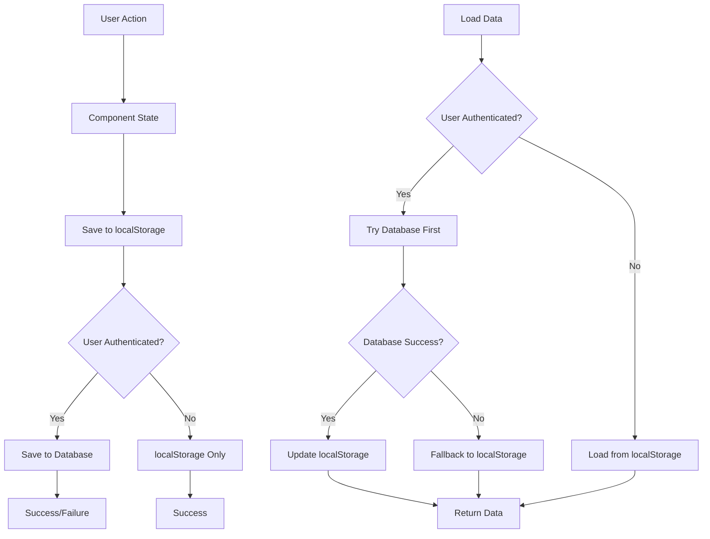

# Sample Widget - Complete Implementation Guide

This sample widget demonstrates all the minimum requirements and best practices for building widgets in the alfred_ ecosystem. It serves as a comprehensive reference implementation that developers can use as a starting point for their own widgets.

## What This Sample Demonstrates

### Core Requirements
- **TypeScript interfaces** - Complete type safety with proper data structures
- **Sync Provider** - Three-tier persistence (memory → localStorage → database)
- **React Component** - Responsive UI with proper state management  
- **Widget Registration** - Proper metadata and registry integration
- **Error Handling** - Graceful degradation and user feedback
- **Data Validation** - Input sanitization and type checking

### Advanced Features
- **Responsive Design** - Adapts to different widget sizes (2x2 to 4x4+)
- **Real-time Updates** - Auto-refresh functionality
- **CRUD Operations** - Create, read, update, delete items
- **Search & Filtering** - Find items by text and completion status
- **Tag System** - Categorize items with custom tags
- **Priority Levels** - High, medium, low priority items
- **Settings Panel** - User-configurable options
- **Data Migration** - Seamless localStorage → database migration
- **Export/Import** - Backup and restore functionality

## File Structure

```
src/components/widgets/SampleWidget/
├── types.ts           # TypeScript interfaces and type definitions
├── index.tsx          # React component implementation
└── sampleWidgetSync.ts # Data persistence sync provider
```

## Architecture Overview

The widget follows a three-layer architecture:

1. **Types Layer** (`types.ts`)
   - Defines all data structures and interfaces
   - Provides type safety and validation
   - Contains widget metadata for registry

2. **Data Layer** (`sampleWidgetSync.ts`)
   - Manages data persistence and synchronization
   - Implements three-tier storage strategy
   - Handles data migration and validation

3. **UI Layer** (`index.tsx`)
   - React component with responsive design
   - State management and user interactions
   - Integration with sync provider

## Quick Start

### 1. Copy the Files

Create the directory structure and copy the three main files:
- `types.ts` - Type definitions and interfaces
- `sampleWidgetSync.ts` - Data sync provider
- `index.tsx` - React component

### 2. Update Database Schema

Add the following table to your Supabase schema:

```sql
-- Create the sample widget data table
CREATE TABLE user_sample_widget_data (
  id UUID DEFAULT gen_random_uuid() PRIMARY KEY,
  user_id UUID NOT NULL REFERENCES auth.users(id) ON DELETE CASCADE,
  widget_instance_id TEXT NOT NULL DEFAULT 'default',
  widget_type TEXT NOT NULL DEFAULT 'sample-widget',
  data JSONB NOT NULL,
  created_at TIMESTAMPTZ DEFAULT NOW(),
  updated_at TIMESTAMPTZ DEFAULT NOW()
);

-- Add unique constraint
ALTER TABLE user_sample_widget_data 
ADD CONSTRAINT unique_user_sample_widget_instance 
UNIQUE (user_id, widget_instance_id);

-- Enable Row Level Security
ALTER TABLE user_sample_widget_data ENABLE ROW LEVEL SECURITY;

-- Create RLS policy
CREATE POLICY "Users can manage their own sample widget data" 
ON user_sample_widget_data FOR ALL 
USING (auth.uid() = user_id);
```

### 3. Register the Widget

The sync provider automatically registers itself when imported. The widget will be available in your widget selector.

### 4. Test the Implementation

The widget includes sample data and comprehensive error handling, so it should work immediately after installation.

## Customization Guide

### Adapting for Your Use Case

1. **Change the Widget Type**
   ```typescript
   // In types.ts
   export const widgetMeta = {
     type: 'your-widget-name', // Change this
     name: 'Your Widget Name',
     icon: 'YourIconName',
     // ... other metadata
   };
   
   // In sync provider
   readonly widgetType = 'your-widget-name';
   ```

2. **Modify Data Structure**
   ```typescript
   // Replace SampleItem with your data type
   export interface YourDataItem {
     id: string;
     // Your properties here
     createdAt: Date;
   }
   
   // Update the data interface
   export interface YourWidgetData {
     settings: { /* your settings */ };
     items: YourDataItem[];
     metadata: { /* your metadata */ };
   }
   ```

3. **Update Database Schema**
   ```sql
   -- Create your table
   CREATE TABLE user_your_widget_data (
     -- Same structure as sample, different name
   );
   ```

4. **Customize the UI**
   - Replace the item rendering logic
   - Modify the settings panel
   - Adjust responsive breakpoints
   - Add your specific features

### Common Customizations

#### Adding New Fields
```typescript
// 1. Add to your item interface
export interface YourItem extends SampleItem {
  customField: string;
  anotherField?: number;
}

// 2. Update the create function
export const createYourItem = (title: string): YourItem => ({
  ...createSampleItem(title),
  customField: 'default',
  anotherField: undefined
});

// 3. Update the form in the component
// Add new input fields to the add/edit dialogs
```

#### Changing Storage Strategy
```typescript
// Modify in sync provider
async saveData(userId: string | null, data: YourWidgetData): Promise<SyncResult<void>> {
  // Add your custom logic here
  // Maybe save to different tables or external APIs
}
```

#### Adding External API Integration
```typescript
// In sync provider
async refreshFromAPI(): Promise<YourWidgetData> {
  const response = await fetch('your-api-endpoint');
  const externalData = await response.json();
  
  // Transform external data to your format
  return transformToYourFormat(externalData);
}
```

## Minimum Requirements Checklist

When creating your own widget, ensure you have:

### Required Files
- [ ] `types.ts` with complete interface definitions
- [ ] `index.tsx` with React component implementation  
- [ ] `[widgetName]Sync.ts` with sync provider
- [ ] `README.ts` with marketplace metadata
- [ ] `icon.png` with 64x64px widget icon
- [ ] Database table with proper RLS policies

### Required Interfaces
- [ ] Widget configuration interface with system properties (`onUpdate`, `onDelete`, `widgetId`)
- [ ] Widget data interface for persistence
- [ ] Component props type extending `WidgetProps<Config>`
- [ ] Default configuration object
- [ ] Widget metadata object for registry

### Required Functions
- [ ] `getDefaultData()` - Returns initial widget data
- [ ] `saveData()` - Implements three-tier persistence
- [ ] `loadData()` - Loads with fallback strategy
- [ ] `migrateData()` - Handles localStorage → database migration
- [ ] Data serialization/deserialization helpers

### Required Component Features
- [ ] Loading state with spinner
- [ ] Error state with recovery options
- [ ] Empty state with call-to-action
- [ ] Responsive design (adapts to 2x2, 3x3, 4x4+ sizes)
- [ ] Settings dialog with save/cancel/delete options
- [ ] Proper state management with React hooks
- [ ] Integration with sync service

### Required Database Setup
- [ ] Table with proper columns (`user_id`, `widget_instance_id`, `data`, etc.)
- [ ] Row Level Security (RLS) enabled
- [ ] Policy allowing users to manage their own data
- [ ] Proper foreign key constraints

## UI/UX Best Practices

### Responsive Design Patterns
```typescript
// Standard responsive breakpoints
const displayMode = useMemo(() => {
  if (width <= 2 && height <= 2) return 'mini';      // 2x2 - Ultra compact
  if (width <= 2 || height <= 2) return 'compact';   // 2x3, 3x2 - Compact
  if (width <= 3 && height <= 3) return 'normal';    // 3x3 - Normal
  return 'expanded';                                  // 4x4+ - Full features
}, [width, height]);
```

### State Management Pattern
```typescript
// Always follow this pattern
const [localConfig, setLocalConfig] = useState(() => ({
  ...DEFAULT_CONFIG,
  ...validateConfig(config || {})
}));

const [data, setData] = useState<WidgetData | null>(null);
const [isLoading, setIsLoading] = useState(true);
const [error, setError] = useState<string | null>(null);
```

### Error Handling Standards
- Always provide fallback data
- Show user-friendly error messages
- Include recovery actions (refresh, retry)
- Log errors for debugging
- Never crash the entire dashboard

## Data Flow Architecture

### Three-Tier Persistence Strategy



### Data Validation Pipeline
1. **Input Validation** - Validate user inputs at form level
2. **Type Validation** - Ensure data matches TypeScript interfaces
3. **Business Logic Validation** - Apply domain-specific rules
4. **Serialization Validation** - Ensure data can be stored/retrieved
5. **Database Constraints** - Final validation at database level

## Testing Your Widget

### Manual Testing Checklist
- [ ] Widget loads properly in all sizes (2x2, 3x3, 4x4)
- [ ] Settings can be opened, modified, and saved
- [ ] Data persists after page refresh
- [ ] Works correctly when logged out (localStorage only)
- [ ] Data migrates properly on first login
- [ ] Error states display appropriately
- [ ] Loading states show during async operations
- [ ] Responsive design works on different screen sizes

### Automated Testing
```typescript
// Example test structure
describe('YourWidget', () => {
  test('loads default data', async () => {
    render(<YourWidget config={mockConfig} width={3} height={3} />);
    await waitFor(() => {
      expect(screen.getByText('Your Widget')).toBeInTheDocument();
    });
  });

  test('saves configuration changes', async () => {
    const onUpdate = jest.fn();
    render(<YourWidget config={{ ...mockConfig, onUpdate }} width={3} height={3} />);
    
    // Interact with settings
    fireEvent.click(screen.getByLabelText('Settings'));
    // ... test configuration changes
    
    expect(onUpdate).toHaveBeenCalled();
  });
});
```

## Security Considerations

### Data Validation
- Always validate data types and ranges
- Sanitize user inputs to prevent XSS
- Limit data size to prevent storage abuse
- Implement rate limiting for API calls

### Access Control
- Use Row Level Security (RLS) for database access
- Never expose sensitive data in client code
- Implement proper authentication checks
- Use secure defaults for all settings

### Privacy
- Only store necessary user data
- Provide data export/delete functionality
- Follow GDPR compliance practices
- Clear localStorage on logout

## Performance Optimization

### React Performance
```typescript
// Memoize expensive calculations
const processedData = useMemo(() => {
  return expensiveDataProcessing(data);
}, [data]);

// Memoize event handlers
const handleItemClick = useCallback((id: string) => {
  // Handle click
}, []);

// Use React.memo for child components
const ItemComponent = React.memo(({ item, onClick }) => {
  return <div onClick={() => onClick(item.id)}>{item.title}</div>;
});
```

### Data Management
```typescript
// Debounce save operations
const debouncedSave = useMemo(
  () => debounce(saveData, 500),
  [saveData]
);

// Cleanup old data
private cleanupOldData(data: WidgetData): WidgetData {
  const maxItems = 1000;
  return {
    ...data,
    items: data.items.slice(-maxItems)
  };
}
```

## Advanced Features

### External API Integration
```typescript
// In sync provider
class YourWidgetSync extends BaseWidgetSync {
  private apiCache = new Map<string, { data: any; expiry: number }>();

  async fetchExternalData(endpoint: string): Promise<any> {
    const cached = this.apiCache.get(endpoint);
    if (cached && Date.now() < cached.expiry) {
      return cached.data;
    }

    const response = await fetch(endpoint);
    const data = await response.json();

    this.apiCache.set(endpoint, {
      data,
      expiry: Date.now() + 300000 // 5 minutes
    });

    return data;
  }
}
```

### Real-time Updates
```typescript
// WebSocket integration
useEffect(() => {
  if (!localConfig.realTimeUpdates) return;

  const ws = new WebSocket('wss://your-websocket-endpoint');
  
  ws.onmessage = (event) => {
    const update = JSON.parse(event.data);
    if (update.type === 'widget-update' && update.widgetId === config?.widgetId) {
      setData(update.data);
    }
  };

  return () => ws.close();
}, [localConfig.realTimeUpdates, config?.widgetId]);
```

### Multi-instance Support
```typescript
// Support multiple widget instances
export interface YourWidgetConfig {
  widgetId: string; // Required for multi-instance
  instanceName?: string;
  // ... other config
}

// In sync provider constructor
constructor(widgetInstanceId: string = 'default') {
  super({
    tableName: 'user_your_widget_data',
    localStoragePrefix: 'alfred-widget-your-widget',
    widgetInstanceId // Use provided instance ID
  });
}
```

## Common Pitfalls & Solutions

### 1. State Management Issues
**Problem**: Component state gets out of sync with persisted data
**Solution**: Always update local state after successful save operations

### 2. Memory Leaks
**Problem**: Event listeners and timers not cleaned up
**Solution**: Use useEffect cleanup functions and AbortController

### 3. Type Safety Issues
**Problem**: Runtime errors due to type mismatches
**Solution**: Implement comprehensive validation functions

### 4. Database Connection Failures
**Problem**: Users lose data when database is unavailable
**Solution**: Always save to localStorage first, sync to database as enhancement

### 5. Responsive Design Problems
**Problem**: Widget doesn't adapt well to different sizes
**Solution**: Define clear breakpoints and test all size combinations

## Additional Resources

### Core Dependencies
- `@/components/ui/*` - shadcn/ui components
- `@/lib/syncService` - Central sync service
- `@/lib/supabase` - Database client
- `sonner` - Toast notifications
- `lucide-react` - Icons

### Useful Patterns
- Check existing widgets for proven patterns
- Follow the established naming conventions
- Use consistent error handling across widgets
- Implement proper loading states
- Always provide meaningful empty states

## Next Steps

1. **Study the Sample**: Understand how all pieces work together
2. **Create Your Schema**: Set up your database table
3. **Adapt the Types**: Modify interfaces for your use case  
4. **Customize the UI**: Build your specific user interface
5. **Test Thoroughly**: Verify all scenarios work correctly
6. **Deploy & Monitor**: Watch for errors and user feedback

This sample widget provides a solid foundation for building robust, user-friendly widgets in the alfred_ ecosystem. Use it as a reference and starting point for your own widget development.

---

## License & Contributing

When creating widgets based on this sample:
- Follow the established code style and patterns
- Include proper error handling and validation
- Test responsive behavior across all widget sizes
- Document any deviations from standard patterns
- Consider contributing improvements back to the sample